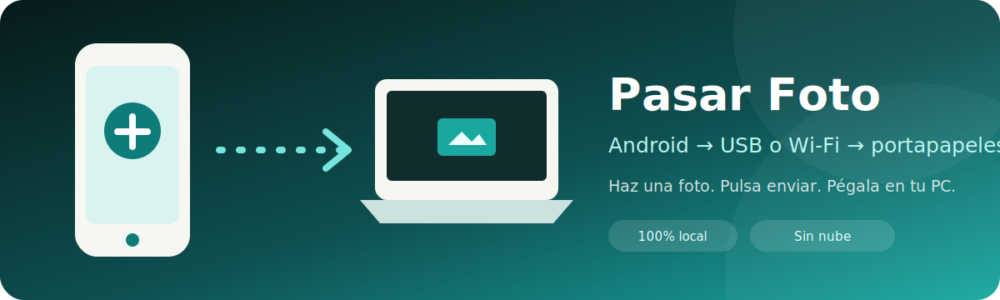
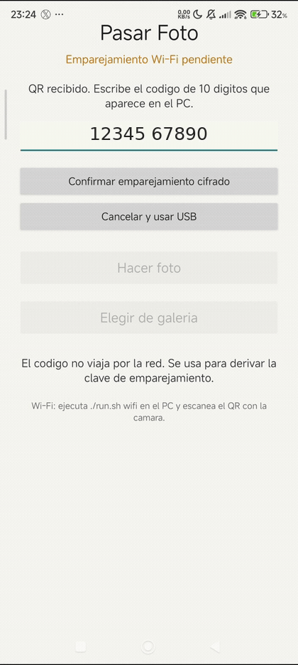
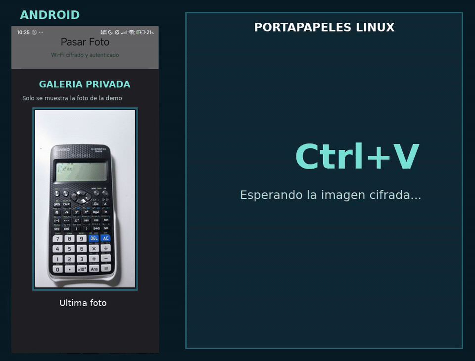
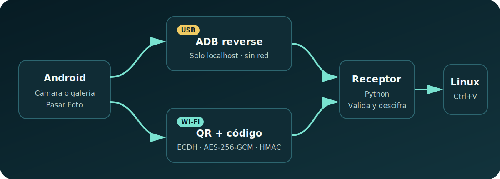

<p align="center">
  
</p>

<p align="center">
  <a href="https://github.com/plc50/pasar-foto/actions/workflows/build-apk.yml"></a>
  <a href="https://github.com/plc50/pasar-foto/releases/latest"></a>
  <a href="LICENSE"></a>
  
  
  
  
  
</p>

<p align="center">
  <strong>Haz una foto en Android y pégala directamente en Linux.</strong><br>
  Por USB o Wi-Fi local, sin nube, mensajería ni cuentas.
</p>

## ✨ Demo

<p align="center">
  <strong>1. Emparejamiento Wi-Fi: QR + código visible en el PC</strong><br><br>
  
</p>

<p align="center">
  <strong>2. Galería Android → portapapeles Linux</strong><br><br>
  
</p>

> Ambas transferencias son reales. La calculadora viajó cifrada desde Android
> y quedó lista para pegar con `Ctrl+V`. Por privacidad, el selector oculta las
> demás miniaturas y el primer GIF utiliza un código de demostración ficticio.

## 🎯 Qué resuelve

Cuando necesito introducir una foto del móvil en una conversación, documento o
formulario del PC, no quiero abrir Telegram, Drive ni correo. Pasar Foto convierte
el teléfono en una cámara conectada directamente al portapapeles:

1. Abres la app.
2. Haces una foto o eliges una imagen.
3. Pulsas aceptar.
4. Pegas en Linux con `Ctrl+V`.

## 🔀 Elige el modo

| | 🔌 USB | 📡 Wi-Fi seguro |
|---|---|---|
| Comando | `./run.sh usb` | `./run.sh wifi` |
| Cable | Necesario | No |
| Depuración USB | Sí | No |
| Red local | No se utiliza | Necesaria |
| Transporte | Túnel `adb reverse` | HTTP con cifrado en la aplicación |
| Exposición | Solo `127.0.0.1` | Una IP privada y TCP `48766` |
| Autenticación | Autorización ADB del PC | QR de un uso + código de 10 cifras |
| Recomendado para | Máximo aislamiento | Comodidad sin cable |

### ¿Qué conexiones funcionan?

| Situación | Resultado | Motivo |
|---|---|---|
| 📶 Móvil y PC en la misma Wi-Fi | ✅ Sí | Comparten red local |
| 📱 Móvil comparte sus datos por hotspot Wi-Fi al PC | ✅ Sí | El móvil y el PC están en la red privada del hotspot |
| 📴 Misma red local pero sin Internet | ✅ Sí | Pasar Foto no necesita Internet |
| 📡 Móvil con datos y PC en una Wi-Fi diferente | ❌ No | Son redes distintas |
| 🏨 Wi-Fi de invitados con aislamiento de clientes | ⚠️ Depende | El router puede impedir que los dispositivos se vean |
| 🔗 Móvil comparte Internet al PC por USB | ⚠️ Posible | Se crea una red privada sobre el cable, pero depende del fabricante |

Si ya existe un cable USB, usa **`./run.sh usb`**. Es más directo que ejecutar
el modo Wi-Fi sobre USB tethering: ADB crea el túnel local y el receptor no abre
ningún puerto en la red. Compartir Internet por USB no es necesario.

## 🧩 Arquitectura

<p align="center">
  
</p>

- **USB:** `adb reverse` lleva la foto por el cable a un receptor que solo
  escucha en `127.0.0.1`.
- **Wi-Fi:** un QR abre la app y un código de 10 cifras confirma físicamente el
  emparejamiento. El contenido viaja con ECDH, AES-256-GCM y HMAC-SHA-256.
- El receptor valida el tipo y la firma de la imagen.
- `wl-copy` en Wayland o `xclip` en X11 la coloca en el portapapeles.

El protocolo Wi-Fi completo y su modelo de amenaza están documentados en
**[docs/SECURE_WIFI.md](docs/SECURE_WIFI.md)**.

## 🛡️ Seguridad por diseño

- 🔑 **Emparejamiento presencial:** el QR contiene un secreto aleatorio de
  256 bits, pero no contiene el código de confirmación visible en el PC.
- 🤝 **Claves efímeras:** intercambio ECDH P-256 y derivación mediante
  HKDF-SHA-256 en cada sesión.
- 🔒 **Confidencialidad e integridad:** fotografías cifradas con AES-256-GCM y
  peticiones autenticadas mediante HMAC-SHA-256.
- 🔁 **Protección anti-replay:** nonce de 96 bits, contador monotónico, marca
  temporal y ventana de repetición.
- ⏱️ **Credenciales temporales:** QR de un uso durante 120 segundos y sesión
  en RAM con caducidad de 2 horas.
- 🧱 **Superficie limitada:** vinculación a una IPv4 privada concreta, sesión
  ligada a la IP emparejada, límite de intentos y rate limiting.
- 🖼️ **Contenido validado:** máximo de 30 MiB y comprobación de MIME y firma
  real JPEG, PNG, WebP, HEIC o HEIF.
- ☁️ **Sin terceros:** no hay nube, telemetría, cuentas, DNS externo ni
  servidores de retransmisión.

Estas medidas reducen riesgos; no constituyen una auditoría formal. El
[documento técnico](docs/SECURE_WIFI.md) explica también los metadatos visibles,
la gestión de claves y los límites del diseño.

## 🚀 Uso rápido

### 1. Instala la APK

Descarga `PasarFoto.apk` desde [GitHub Releases](https://github.com/plc50/pasar-foto/releases/latest) e instálala
en Android. Las Releases se firman con una clave dedicada y estable; no están
destinadas a Google Play. También puedes compilar una APK de desarrollo local:

```bash
./scripts/install-and-run.sh
```

### Opción A: USB

En Android, habilita **Opciones de desarrollador → Depuración USB**, conecta el
cable, acepta la huella del ordenador y ejecuta:

```bash
./run.sh usb
```

### Opción B: Wi-Fi seguro

Instala una vez las dependencias del receptor Wi-Fi:

```bash
./scripts/install-wifi.sh
```

Conecta el móvil y el PC a la misma red local, o conecta el PC al hotspot Wi-Fi
del propio móvil, y ejecuta:

```bash
./run.sh wifi
```

Escanea el QR, abre Pasar Foto y escribe en la app el código de 10 cifras que
muestra el PC. El QR por sí solo no autoriza la conexión.

En ambos modos, cuando la app muestre que el receptor está preparado, haz una
foto y pégala en Linux con `Ctrl+V`.

## 📦 Requisitos

### Compatibilidad real

No depende de Arch Linux. Funciona en distribuciones Linux de escritorio que
cumplan estos requisitos:

- kernel Linux con `/proc`;
- Bash y Python 3;
- ADB / Android platform-tools para el modo USB;
- `cryptography`, `qrencode` e `iproute2` para el modo Wi-Fi;
- `wl-copy` en una sesión Wayland o `xclip` en una sesión X11.

Esto incluye normalmente Arch, Debian, Ubuntu, Fedora, openSUSE y derivadas.
No significa literalmente cualquier sistema Linux: una instalación mínima,
un servidor sin escritorio, Mir, macOS o Windows necesitan otro backend.

Comprueba el equipo antes de conectar el móvil:

```bash
./scripts/check-system.sh usb
./scripts/check-system.sh wifi
```

| Componente | Requisito |
|---|---|
| Teléfono | Android 10 o superior |
| USB | ADB / Android platform-tools, opcional |
| Wi-Fi | Python `cryptography`, `qrencode`, `iproute2`, opcional |
| Wayland | `wl-clipboard` |
| X11 | `xclip` |
| Receptor | Python 3 |
| Compilación | Android SDK + JDK |

Ejemplos:

```bash
# Arch Linux, ambos modos
sudo pacman -S android-tools android-udev wl-clipboard qrencode iproute2 python-pip

# Debian / Ubuntu, Wayland y ambos modos
sudo apt install adb wl-clipboard qrencode iproute2 python3-venv

# Debian / Ubuntu con X11
sudo apt install adb xclip qrencode iproute2 python3-venv

# Fedora, Wayland y ambos modos
sudo dnf install android-tools wl-clipboard qrencode iproute python3

# Fedora con X11
sudo dnf install android-tools xclip qrencode iproute python3

# openSUSE con Wayland
sudo zypper install android-tools wl-clipboard qrencode iproute2 python3
```

Después ejecuta `./scripts/install-wifi.sh`; crea `.venv` dentro del proyecto e
instala la versión compatible de `cryptography`.

## 🛠️ Desarrollo

```bash
# Validar scripts y Python
bash -n run.sh scripts/*.sh
python3 -m unittest discover -s tests -v
./scripts/test-java-crypto.sh

# Construir APK
./scripts/build-apk.sh
```

El script detecta automáticamente `ANDROID_HOME`, `ANDROID_SDK_ROOT`, la
plataforma instalada y la versión más reciente de Android build-tools.

### Publicar una APK

GitHub Actions construye y adjunta la APK automáticamente al crear una etiqueta:

```bash
git tag v2.0.0
git push origin v2.0.0
```

No subas `dist/PasarFoto.apk` ni ningún archivo de `signing/` al repositorio.
Los binarios deben vivir en **Releases**, las claves en GitHub Secrets y el
código fuente en Git.

## 🎬 Grabar nuevas demos

La forma más clara es reflejar el móvil con `scrcpy` y grabar el monitor con
OBS. Para Wi-Fi conviene crear dos GIF cortos: uno del emparejamiento QR +
código y otro de la foto apareciendo al pulsar `Ctrl+V`.

La guía completa está en
**[docs/RECORDING_DEMO.md](docs/RECORDING_DEMO.md)**. El resumen es:

```bash
./run.sh wifi
scrcpy --window-title "Pasar Foto · Android" --max-size 900 --stay-awake
# Graba 10-20 segundos con OBS.
./scripts/video-to-gif.sh \
  "$HOME/Videos/tu-grabacion.mkv" docs/assets/demo-transfer.gif
```

Intenta mantener cada GIF por debajo de 8 MB para que GitHub lo cargue rápido.

## 🔒 Privacidad y límites

- En USB, el servidor escucha únicamente en `127.0.0.1`.
- En Wi-Fi, se vincula a una IPv4 privada concreta y requiere QR + código.
- Las sesiones Wi-Fi caducan, viven solo en memoria y están ligadas a la IP que
  completó el emparejamiento.
- No se conserva la imagen recibida: el archivo temporal se elimina después de
  entregarlo al portapapeles.
- No hay telemetría, cuentas, nube ni servidores externos.
- El modo Wi-Fi tiene pruebas criptográficas cruzadas Java/Python, pero no ha
  sido auditado externamente.
- Está pensado para Linux; macOS y Windows aún no tienen backend de
  portapapeles.

## 🗺️ Roadmap

- [x] Emparejamiento Wi-Fi mediante QR y confirmación humana.
- [x] Cifrado y autenticación de extremo a extremo en la red local.
- [ ] Compartir varias imágenes en una sola operación.
- [ ] Paquetes instalables para distribuciones Linux.
- [ ] Backend de portapapeles para macOS.
- [ ] Backend de portapapeles para Windows.

## 📄 Licencia

Publicado bajo la [licencia MIT](LICENSE).

Los problemas de seguridad deben comunicarse siguiendo
[SECURITY.md](SECURITY.md), no mediante una incidencia pública.
